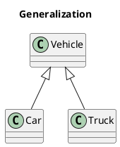

> この記事は主にJava OOPの基本的な概念と関連するUML図について説明します。

## 1. Java OOPとは

Javaはオブジェクト指向プログラミング言語です。オブジェクト指向プログラミング言語とは、プログラムをオブジェクトとして捉え、オブジェクト間の相互作用によってプログラムを構築するプログラミングの手法です。オブジェクト指向プログラミング言語は、オブジェクト指向プログラミングの手法を採用しているプログラミング言語のことを指します。オブジェクト指向プログラミング言語には、Javaの他にもC++, C#, Python, Rubyなどがあります。

## 2. Java OOPの3つの特徴
### 2.1. カプセル化
カプセル化とは、オブジェクトの状態を隠蔽し、外部からのアクセスを制限することです。カプセル化によって、オブジェクトの状態を外部から変更されることを防ぎ、オブジェクトの状態を安全に保つことができます。カプセル化によって、オブジェクトの状態を外部から変更するためには、オブジェクトのメソッドを通じて変更する必要があります。カプセル化によって、オブジェクトの状態を外部から変更するためには、オブジェクトのメソッドを通じて変更する必要があります。カプセル化によって、オブジェクトの状態を外部から変更するためには、オブジェクトのメソッドを通じて変更する必要があります。カプセル化によって、オブジェクトの状態を外部から変更するためには、オブジェクトのメソッドを通じて変更する必要があります。カプセル化によって、オブジェクトの状態を外部から変更するためには、オブジェクトのメソッドを通じて変更する必要があります。

メリット：
- 下げた結合度：結合とは、モジュール間の依存関係の強さを表すものです。結合が少ない、すなわちモジュール間の依存関係が弱いほど、各モジュールは独立して開発、テスト、最適化、使用、理解、および変更しやすくなります。
- 保守の負担を軽減: 結合が少ないモジュールは、変更の影響範囲が狭くなるため、保守の負担を軽減できます。また、プログラマーが理解しやすくなるため、デバッグが容易になります。
- パフォーマンスを効果的に調整: 結合が少ないモジュールは、パフォーマンスに影響を与えるモジュールを特定して最適化しやすくなります。
- ソフトウェアの再利用性を向上: 結合が少ないモジュールは、他のモジュールで再利用しやすくなります。
- 大規模システムのリスクを低減: 結合が少ないモジュールは、システム全体が使用できなくなった場合でも、使用できる可能性があります。

次の `Person` クラスは、`name`、`gender`、`age` などの属性をカプセル化します。外部からは、`get()` メソッドを使用して `Person` オブジェクトの名前属性と性別属性のみを取得でき、年齢属性は取得できませんが、`age` 属性は `work()` メソッドで使用できます。

`gender` 属性は `int` データ型で保存することに注意してください。カプセル化により、ユーザーはこのような実装の詳細に気付くことはありません。また、`gender` 属性のデータ型を変更する必要がある場合でも、クライアント コードに影響を与えずに行うことができます。

具体的には、`Person` クラスは以下のとおりです。

```java
public class Person {
    private String name;
    private int gender;
    private int age;

    public String getName() {
        return name;
    }

    public String getGender() {
        return gender == 0 ? "man" : "woman";
    }

    public void work() {
        if (age < 18) {
            System.out.println("You are not allowed to work.");
        } else {
            System.out.println("You are allowed to work.");
        }
    }
}
```


### 2.2. 継承
継承は、IS-A 関係を実装します。例えば、Cat と Animal は IS-A 関係であるため、Cat は Animal から継承することができます。これにより、Cat は Animal の非 private 属性とメソッドを取得することができます。

継承は、リスコフの置換原則に従うべきです。サブクラスのオブジェクトは、スーパークラスのオブジェクトとして使用できる必要があります。

Cat は Animal として使用できます。つまり、Animal 参照を使用して Cat オブジェクトを参照できます。スーパークラスの参照がサブクラスのオブジェクトを指すことを、拡大変換と呼びます。

```java
Animal animal = new Cat();
```

### 2.3. ポリモーフィズム
多態性とは、1つのメソッドが、オブジェクトに応じて、複数(poly)の形態(morph) を持つ特性(ism)のことです。
次のコードでは、Instrument 型の変数 instrument を宣言し、Wind オブジェクトと Percussion オブジェクトを割り当てています。instrument 変数を使用して play() メソッドを呼び出すと、それぞれのオブジェクトの play() メソッドが実行されます。
    
```java
public class Instrument {
    public void play() {
        System.out.println("Instrument is playing...");
    }
}

public class Wind extends Instrument {
    public void play() {
        System.out.println("Wind is playing...");
    }
}

public class Percussion extends Instrument {
    public void play() {
        System.out.println("Percussion is playing...");
    }
}

public class Music {
    public static void main(String[] args) {
        List<Instrument> instruments = new ArrayList<>();
        instruments.add(new Wind());
        instruments.add(new Percussion());
        for(Instrument instrument : instruments) {
            instrument.play();
        }
    }
}
```

##　UML図

Generalization(継承)

