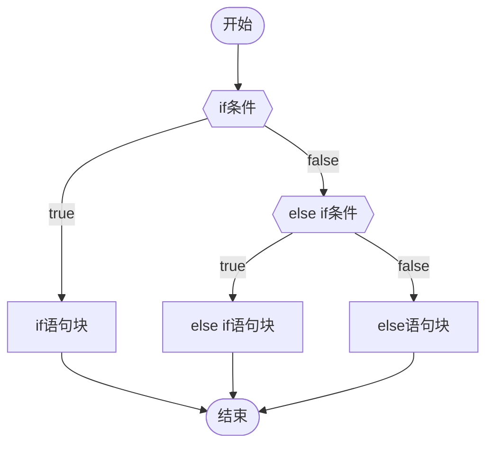
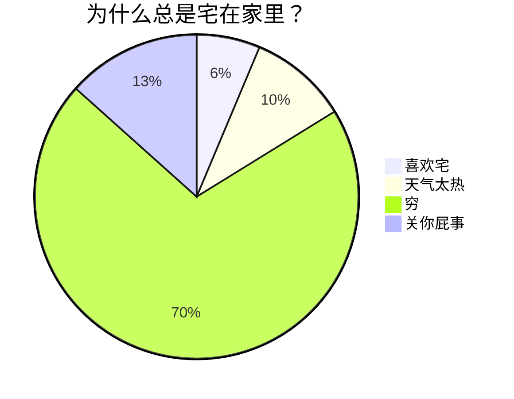

## Markdownとは?

---
1. **Markdown**とは、**HTML(Hypertext Markup Language)** とは異なり、非常にシンプルで簡単に習得できる軽量なマークアップ言語です。
2. **Markdown**は、**純粋なテキスト形式**で文書を作成します。キーボードではなくマウスに依存し、**執筆自体**に集中し、**書写**の魅力を感じることができます。
3. **Markdown**は、いくつかの簡単な**識別子**を使用して、テキストに**適切な形式**を与えることができます。
4. **Markdown**の核心的な特徴は、冗長なものを削除して簡潔で洗練されたものにすることです。
5. **Markdown**は**メモ**や**ウェブページ**の作成に最適なプラットフォームです。


## なぜMarkdown？

---
**Markdownの利点**
1. **Markdown** 複雑で膨大な機能に圧倒されることなく、内容に集中して、効率的で洗練されたメモを書くことができます。
2. **Markdown** 純粋なテキスト形式で文書を作成するため、キーボードを主体に、書くことそのものに集中することができます。
3. Markdown の語法はシンプルでわかりやすく、短い文字数で表現することができます。これにより、思考を整理し、より明確に表現することができます。

**Markdown** で何かを書くときは、以下のことを心に留めておいてください：

>10 文字で済むなら、11 文字は使わない。

また、**Markdown** を頻繁に使用していると、次のような不思議な感覚を覚えるかもしれません。

- 書くことは、思考の進歩を促す。
    - 思索を前進させるような何かが、あなたの思考を引きずっていくような感覚。


## Markdown 语法

---
- **提示1：** 本教程推荐使用Obsidian打开阅读
- **提示2：** 下文提到的所有标识符都是 **英文状态** 的！

### 1. 标题&目录

---
#### 1.1 标题
- Markdown标题共有 **六级** ，和 HTML 一样
- 区分 **一级标题 $\rightarrow$ 六级标题**
    - **标题 的格式**：
        - `#` $\times$ 标题级数 + `空格` +文本内容
```
这是一段普通的文本

# 这是一级标题 
## 这是二级标题 
### 这是三级标题 
#### 这是四级标题 
##### 这是五级标题 
###### 这是六级标题
```


#### 1.2 目录
- **目录 的格式：**
    - 在文档的顶部`[toc]` ，会根据 **标题** 自动生成目录 ( **Table of Content** )
- 不是所有 **MD编辑器** 都支持目录生成
    -  **Obsidian** 就不支持，不过 **OB** 是自带大纲的，就是目录的效果
```
输入下方内容会生成一个目录：

[toc]
```


### 2.1 斜体&粗体

---
#### 2.1 斜体
- **斜体 的格式：**
    1.  `*` + 文本内容 + `*`
    2.  `_` + 文本内容 + `_`
- **说明**：
    - 斜体文本，首尾只有 **单个** 标识符
```
这是一段普通文本

*这里是一段斜体文本*
_这也是一段斜体文本—
```

#### 示范

这是一段普通文本

_这里是一段斜体文本_  
_这也是一段斜体文本_

鲁迅原名是什么[^1] ，浙江哪里人[^2]

<!-- 这里是变量区域 -->
[^1]: 周树人
[^2]: 绍兴人

<audio controls="controls" preload="none" src="https://www.ldoceonline.com/media/english/exaProns/p008-001803372.mp3?version=1.2.37"></audio>
$\ce{CO2 + C -> 2 CO}$

$$ \ce{Zn^2+ <=>[+ 2OH-][+ 2H+] $\underset{\text{amphoteres Hydroxid}}{\ce{Zn(OH)2 v}}$ <=>[+ 2OH-][+ 2H+] $\underset{\text{Hydroxozikat}}{\ce{[Zn(OH)4]^2-}}$} $$
$$ \begin{array}{lll} \nabla\times E &=& -\;\frac{\partial{B}}{\partial{t}} \ \nabla\times H &=& \frac{\partial{D}}{\partial{t}}+J \ \nabla\cdot D &=& \rho \ \nabla\cdot B &=& 0 \ \end{array} $$
$$ i\hbar\frac{\partial \psi}{\partial t} = \frac{-\hbar^2}{2m} \left(\frac{\partial^2}{\partial x^2} + \frac{\partial^2}{\partial y^2}+\frac{\partial^2}{\partial z^2} \right) \psi + V \psi $$
$$ i\hbar\frac{\partial \psi}{\partial t} = \frac{-\hbar^2}{2m} \left(\frac{\partial^2}{\partial x^2} + \frac{\partial^2}{\partial y^2}+\frac{\partial^2}{\partial z^2} \right) \psi + V \psi $$




> [!failure]+ 这是第一层
> 这是第一层的内容
>> [!bug]+ 这是第二层
>> 这是第二层的内容
>> >[!warning]- 这是嵌套的第三层，且默认为折叠状态
>> >这里是第三层被折叠的内容
> 

